## S3
1. Raw bucket showing raw/ and the sample_output.csv inside: 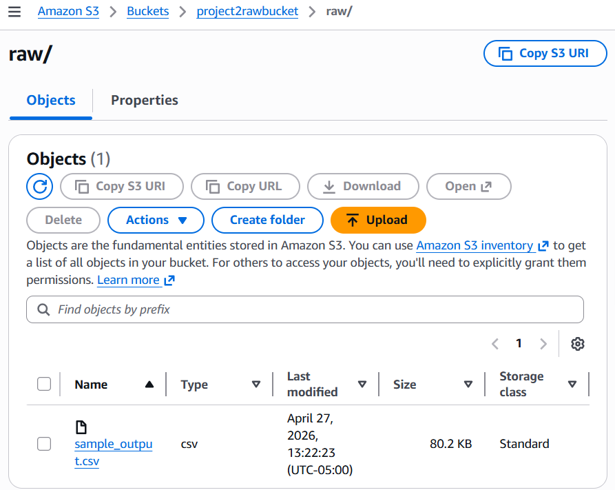
2. Processed bucket showing the four partition folders (region=Midwest/, region=Northeast/, region=South/, region=West/): 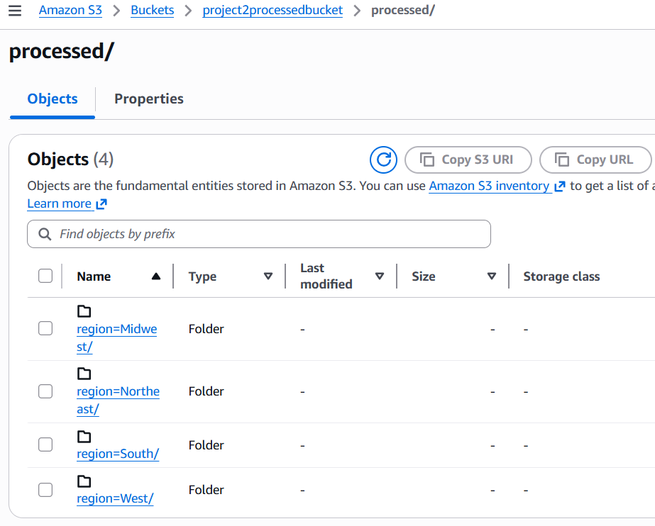
3. The Midwest partition folder open showing parquet file inside: 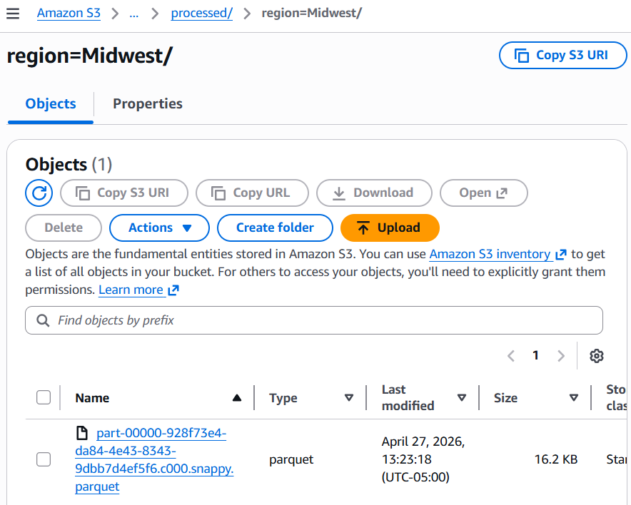

## AWS Glue
4. Glue Job showing the Project2ETLJob: 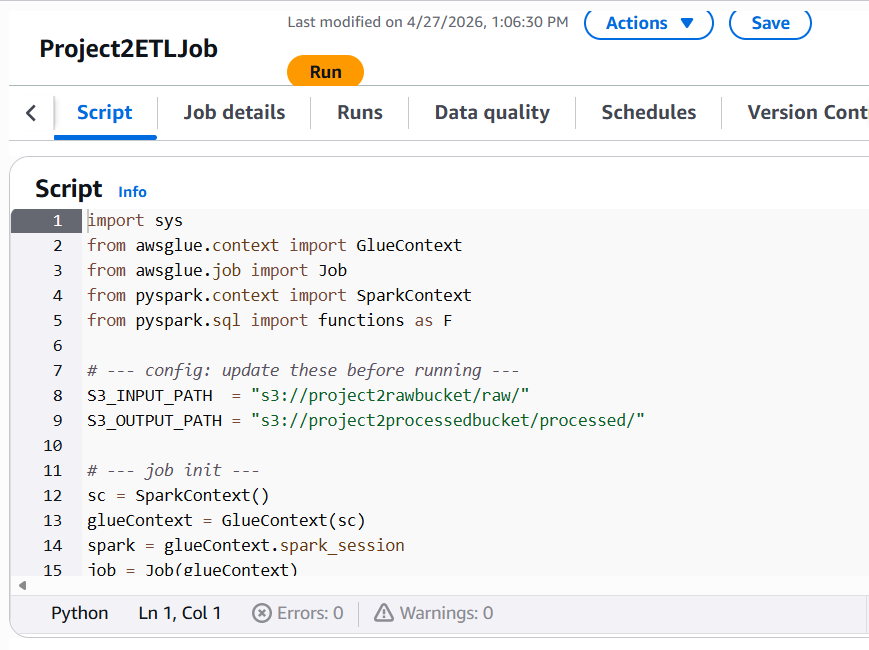
5. Successful job run details page that shows the run status as succeeded: 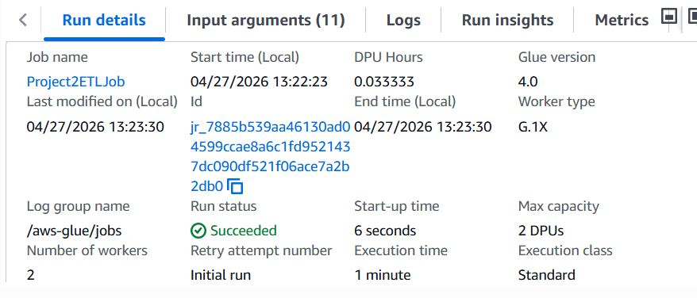
6. Job run history showing the different test runs: 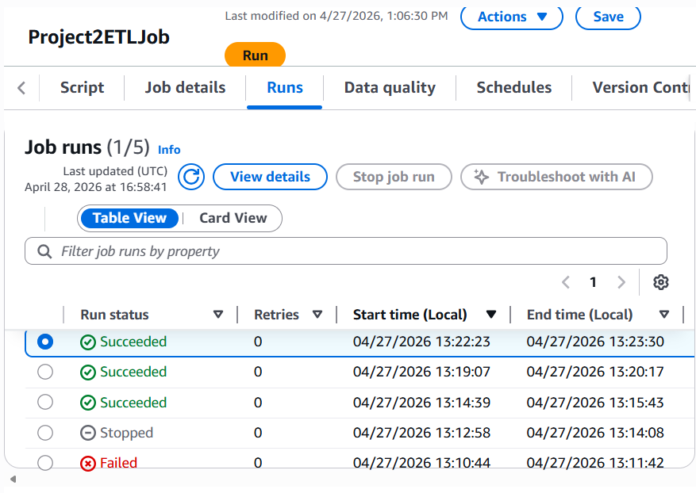

## AWS Lambda
7. Lambda function overview page showing the S3 connection: 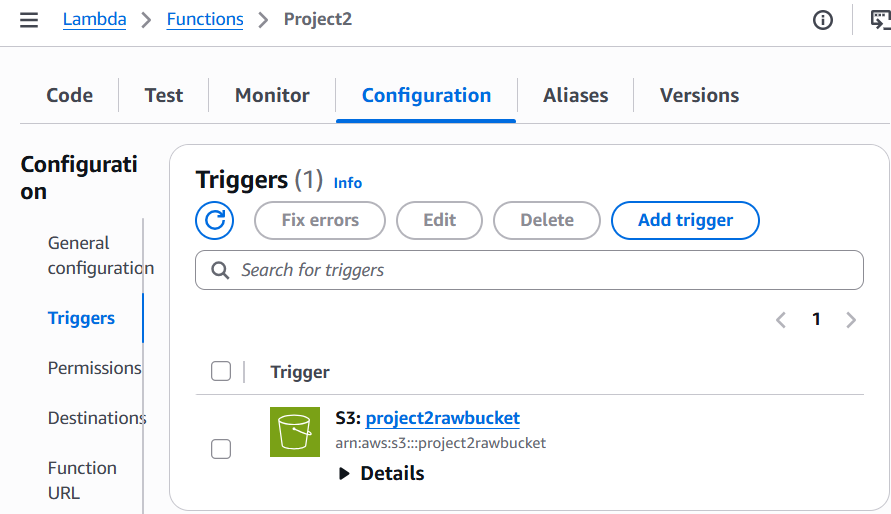
8. Successful test execution run: 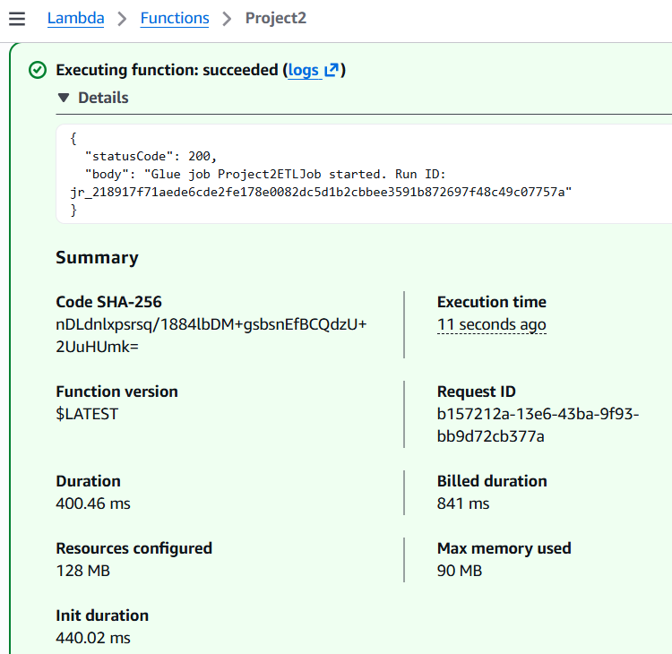

## AWS Athena
9. Revenue by region query results: 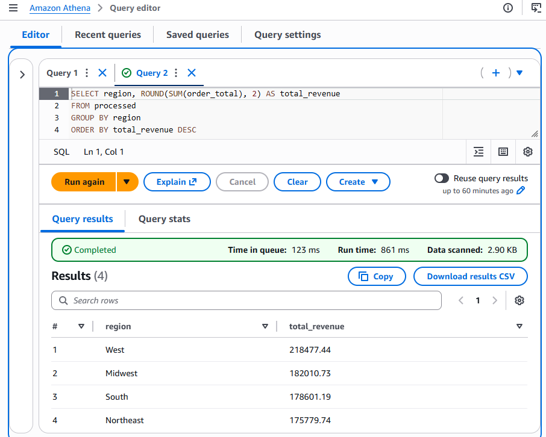
10. Another query result: 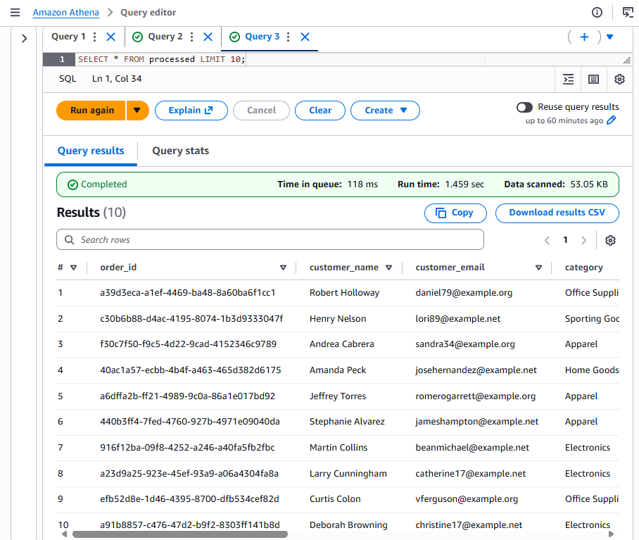

## AWS Glue Crawler
11. Crawler page showing the project2crawler with the ready status: 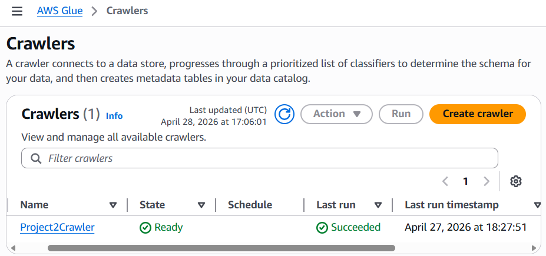
12. Glue Data Catalog showing the project2db database and processed table inside: 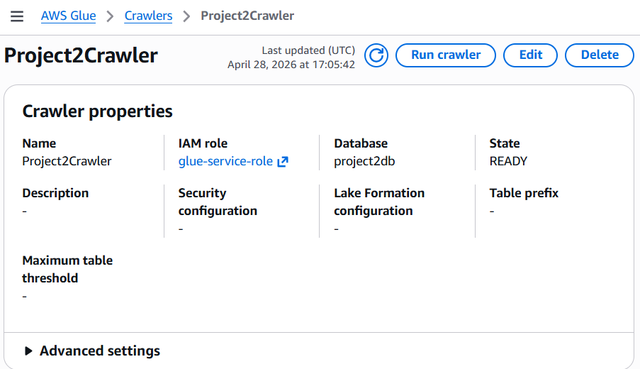